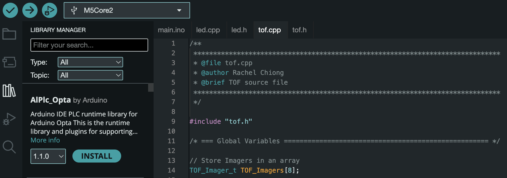
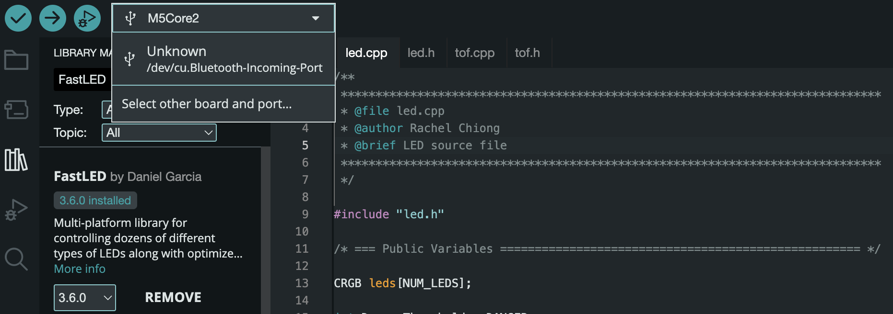
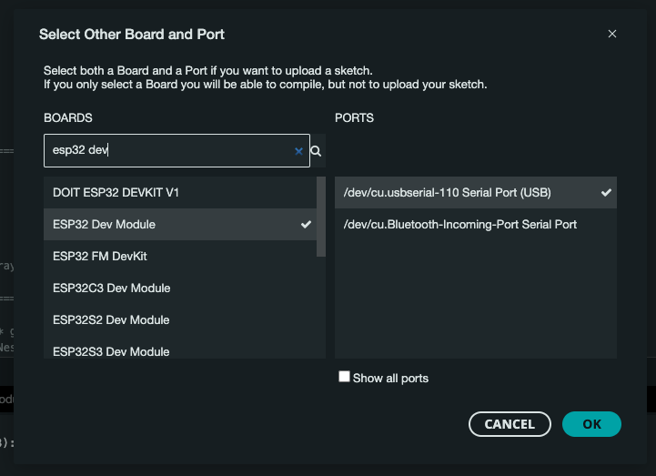
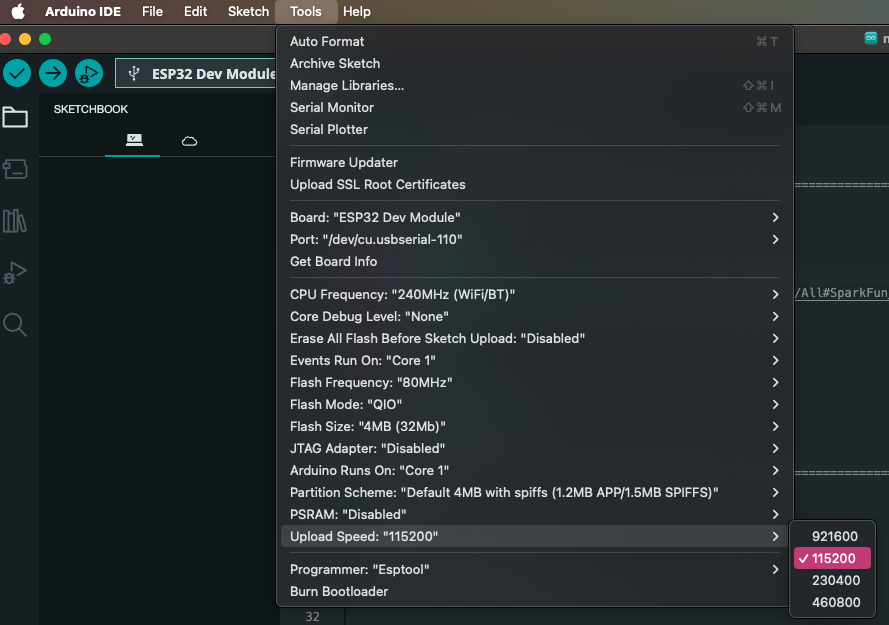
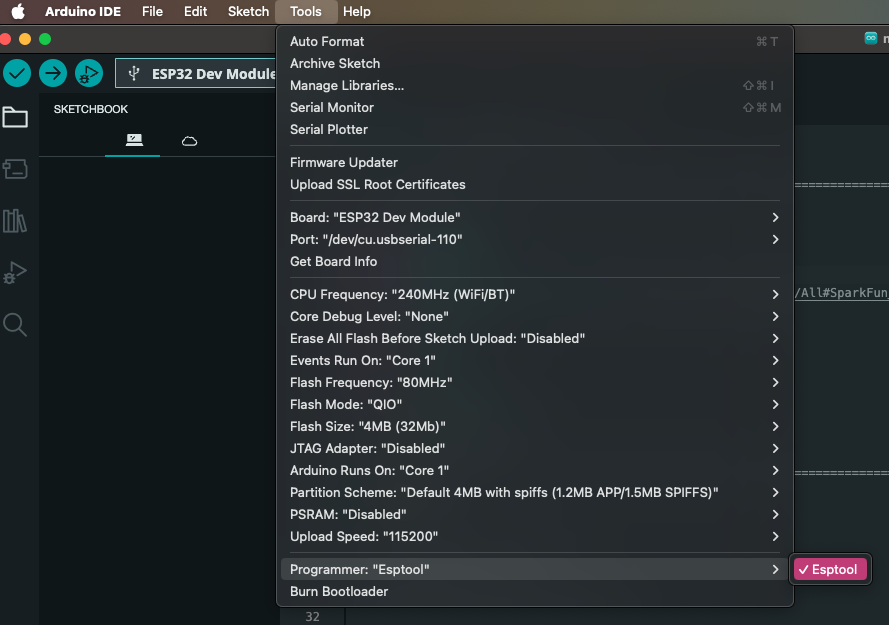

# NRM-Navigation
## FW v0.1.0 Features (Release Notes):
### TOF
- Enables two ToF sensors connected to the board
- Uses an aggregate function which takes the minimum value in each column in the 8x8 array and outputs the 1x4 array of distance values in mm.

## Setting up the programming environment for the arduino: M5Core2
1. Download the latest version of the arduino IDE.
2. Open the arduino IDE and click the third icon (library) to open the library manager and search for these libraries and install:


- M5Core2
- SparkFun_VL53L5CX_Arduino_Library
- FastLED
- ArduinoUnit

Navigate to the boards manager (the icon above the library manager) and search ```ESP32```. Install the Espressif board library.

3. Restart the Arduino IDE.

4. Ensure the arduino is connected to your computer. Click the dropdown menu and
select the connection. Select M5Core2 from the list of boards.



## Setting up the programming environment for the ESP-WROOM-32 (ESP32 Plus)
This board uses the same ESP32 chip and is cross-compatible with the M5Core2 (including pinouts and clocks). However, there are a few differences with the setup in the arduino IDE.

1. Install ESP32 Board library from the manager (see above).
2. Connect the board to your computer. Click on the dropdown and select ```ESP32 Dev Module```.

3. In the top menu, select ```Tools -> Upload Speed -> 115200```.

4. Then, select ```Tools -> Programmer -> ESPTools```.

5. Now, compile and flash the board. Everything written for the M5Core2 should work as intended.

## Setting up the programming environment for the ESP32 DEVKIT V1 DOIT board
This board uses the same ESP32 chip and is cross-compatible with the M5Core2 and the ESP-WROOM-32 (including pinouts and clocks). However, there are a few differences regarding the use of the microcontrollers.

1. Follow the setup instructions of the ESP-WROOM-32 (ESP32 Plus).
2. Download additional drivers from the [manufacture webpage](https://www.silabs.com/developers/usb-to-uart-bridge-vcp-drivers?tab=downloads).
3. Install drivers - System dependent! For Windows devices use device manager. After installing the drivers, the device should be listed in the Ports section as shown below.

4. The BOOT key (RED) must be pressed while flashing new code.
5. After flashing the board, the EN Pin (YELLOW) has to be pressed.

